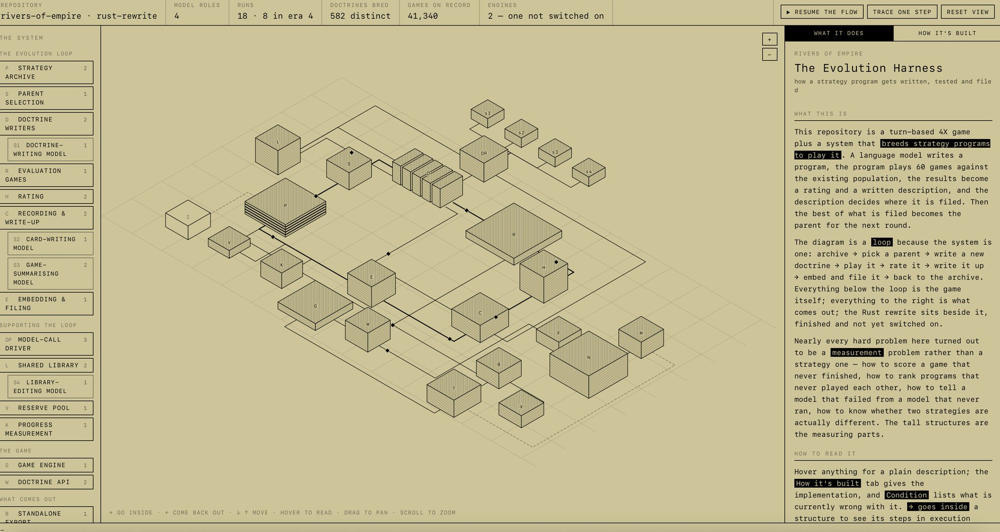

# visualizer

A tool that reads a codebase and draws it as an isometric map you can walk
through — with execution flowing along the edges while you watch.

The image above is the target. It is a mock-up, not output from this repo yet.

## What it should do

Point it at any repository and get back a single page that answers three
questions a README usually cannot:

1. **What are the parts?** Every module is a block on an isometric plane,
   grouped the way the system is actually organised rather than the way the
   directories happen to be laid out.
2. **How does the work move?** Edges are real call paths, and a flow animates
   along them. `TRACE ONE STEP` advances a single hop; `RESUME THE FLOW` lets it
   run.
3. **What is inside a part?** Blocks open. `GO INSIDE` descends into a module to
   see its own steps as another map at the next level down.

The prose panel on the right explains the system in plain language, and the
sidebar is a keyed index of every part, so the diagram never has to carry
labels it cannot fit.

## Why it might be worth building

Architecture diagrams go stale because they are drawn by hand, separately from
the code. This one is generated from the code, so it cannot drift. And unlike a
call graph dumped from a static analyser, it is arranged and annotated to be
*read* — the point is the explanation, not the completeness.

## Status

Nothing is built. This repository currently holds the design intent, the visual
specification derived from the reference, and the open questions in
`docs/decisions.md` that need answering before code is worth writing.

## Layout

    docs/aesthetic.md    the visual language, measured from the reference
    docs/decisions.md    what has to be decided before building
    docs/reference/      the source image
